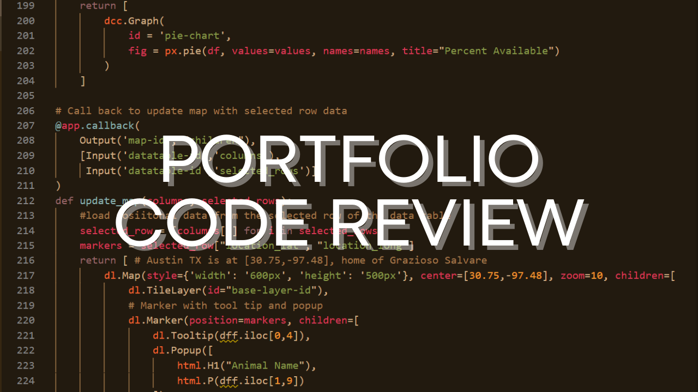

```
Hello World. 
My name is...
```
# Morgana Val.
### I love experimenting with new technologies!
As I complete my B.S. in Computer Science, I want to continue to establish my skills as a developer, focusing on cloud and internet technologies. In addition to improving what is already in my portfolio, some topics I hope to explore next are:
- Typescript and Angular.js
- C++ (data structures mainly)
- React
- Cybersecurity

View my [resume](https://www.notion.so/morganaval/Morgana-Val-eb08d6e601924ca2963c59f242514500).

## Code Review
As apart of the completion of my degree program, I needed to select one to three projects that best represent my skills and proved I have learned the core computer science concepts over the past two years.  I unfortunately did not have access to the complete extent of my degree projects (my desktop computer is stored as I am moving) but I chose two projects that showed my ability to work with new technologies and understand the frameworks already establsihed.  This final project also required me to perform a code review before making modifications.  There were five course outcomes I had to prove my knowledge of the computer science field, and the code review fulfills the second and fifth:

> {CS-499-02} Design, develop, and deliver professional-quality oral, written, and visual communications that are coherent, technically sound,
and appropriately adapted to specific audiences and contexts <br/>
> {CS-499-05} Develop a security mindset that anticipates adversarial exploits in software architecture and designs to expose potential vulnerabilities,
mitigate design flaws, and ensure privacy and enhanced security of data and resources 

[](https://www.loom.com/share/58fb4ee2a6bd4f29b211d4e682f31f07?sharedAppSource=personal_library "CS499 Github Pages Portfolio Code Review")


## Projects
### projectOne: Grazioso Salvare Database Dashboard 
[](python.org) 


[](mongodb.com) 


[](https://www.json.org) 


[](numpy.org) 


[](pandas.pydata.org) 


[](plotly.com/dash/)

<br/>
[](https://github.com/morgval/GS-Dashboard)

The GSDB Dashboard project consisted of two parts; there was a program to create, read, update, and delete records from their MongoDB database and that program's test module, and a browser based dashboard to view a datatable that displayed records based off of certain search parameters and a chart and map to sort those records.  I created it during CS340: Advanced Programming Concepts.  However, during this course, CS499, I revised a few algorithms to make the charts more interactive and revised the map feature to work as originally intended, but not executed.  My biggest challenge with this artifact has consistently been that I keep shooting too high. I really wanted this to work properly through Jupyter, but I wasn't able to find a proper tutorial on it until recently, so here is what I still want to polish off:

- [ ] Revise JupyterDash module to work on GitHub
- [ ] Revise README

This project helped me fulfill three course outcomes:

> {CS-499-01} Employ strategies for building collaborative environments that enable diverse audiences to support organizational decision
making in the field of computer science <br/>
> {CS-499-03} Design and evaluate computing solutions that solve a given problem using algorithmic principles and computer science practices and
standards appropriate to its solution, while managing the trade-offs involved in design choices (data structures and algorithms) <br/>
> {CS-499-04} Demonstrate an ability to use well-founded and innovative techniques, skills, and tools in computing practices for the purpose of
implementing computer solutions that deliver value and accomplish industry-specific goals (software engineering/design/database) 

Using the technologies linked above, I learned to consider an organization's needs regarding data and how they use data to make decisions. It was one thing when I took my database course and learned about how the RDBMS interacted with the server that held the memory to run the information for the user application, but it was entirely different to actually develop one.  Developing a CRUD module for database management and then a dashboard to filter and present information gave me much more confidence to take on learning new web technologies.  

### projectTwo: Student Records Web Keeper
[](https://developer.mozilla.org/en-US/docs/Web/HTML) 


[](javascript.com) 


[](getbootstrap.com) 


[](jquery.com) 

<br/>
[](https://github.com/morgval/Student-Records-Dashboard)

The Student Records project helped me solidify my understanding in the same three course outcomes as the GS-Dashboard. Basically, the program keeps student and class records to register students to courses.  During this course, I implemented a few different algorithms into a Javascript CRUD tutorial I found on YouTube to expanded the functionality of the tables.  I was able to make it so a student could be registered to a course; the user would selected the course, click register, enter the Student ID, click register again and could return to the student tab to see the student record's class roster populated.  I also implemented the following algorithm to restrict students with a GPA too low to only be able to register to 3 classes:

```javascript
//logic for validating a student has the ability to register
       var gpa = document.getElementById(selectedStudent + "-gpa").value; //get GPA data for student (in fourth column)
       var table = document.getElementById(selectedStudent + "-classRoster");
       var numClasses = table.length;
       var tbody = table.getElementsByTagName('tbody')[0];
       if (gpa < 3.0 && numClasses >= 3) {
           return (alert('Cannot register student.  GPA requirement not met.'))
       } else {
           //placing class data in student table
```

This project began in IT315: Object Oriented Analysis, where we used the Agile development lifecycle to plan the use cases prior to development.  These use cases then became the basis for testing the development. I wanted to implement classes to represent the objects in this project but was unable to get the project to function properly.  I was disappointed I wasn't able to accomplish all I had originally thought because of the unexpected bugs I hit, but I learned a lot about problem solving and am now very excited to call this my MVP (minimum viable product).  It has the basic features, and it works but it has bugs and lots of room for improvement as I progress as a programmer.  I would also like to look into:

- [ ] implementing React
- [ ] optimiziing the compilation time
- [ ] adding a Student Roster setting in the Class table
- [ ] expanding Date() capabilities

## Self Assessment


